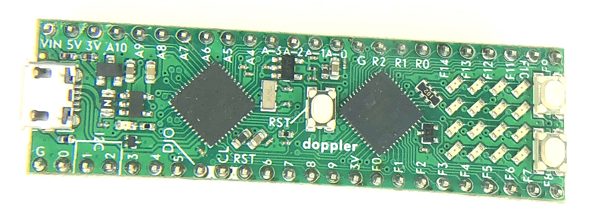
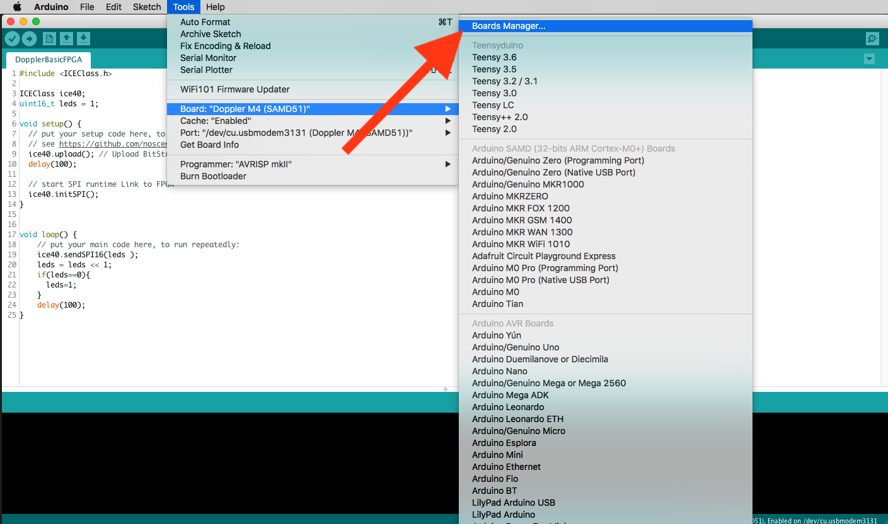
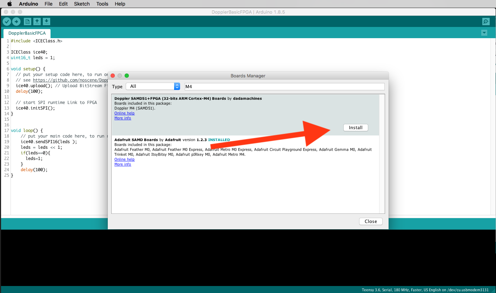
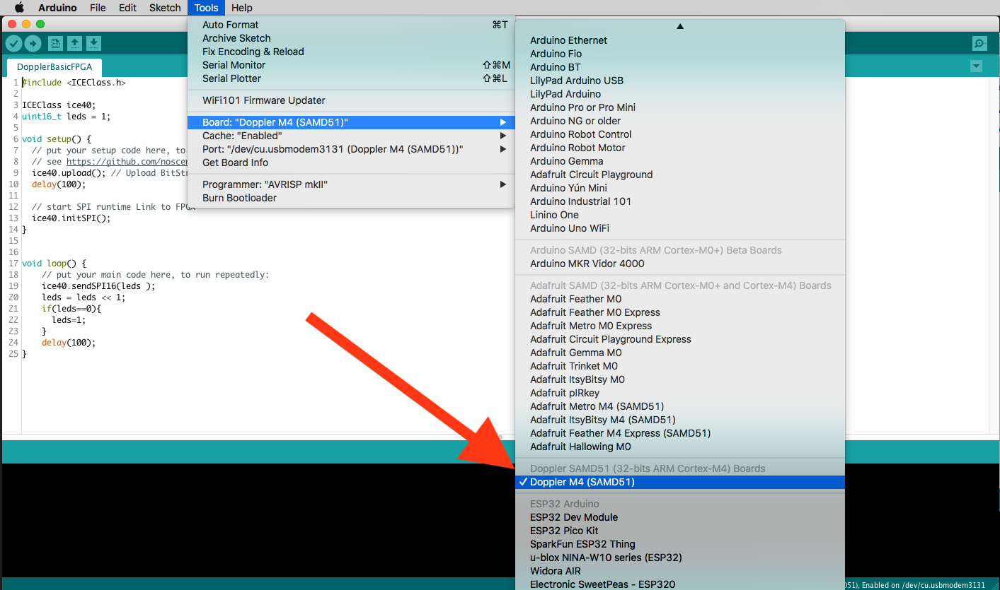

# Doppler - CortexM4 meets FPGA

- arduino compatible board
- cpu: SAMD51 120mhz
- FPGA: Lattice ice40up5K
- micro usb
- 17 leds
- reset button
- 2 custom buttons

Builds based on this repo:
https://github.com/noscene/ArduinoCore-samd

## Setup
First need install the arduino ide from 
- https://www.arduino.cc/en/Main/Software

then add board URLs (comma separated):

- https://adafruit.github.io/arduino-board-index/package_adafruit_index.json,
- https://noscene.github.io/doppler4arduino/package_doppler_index.json


go to boardmanager

install both boards

select the Doppler Board

select USB Port


## Board Layout and PINs

```
    /*          DOPPLER-Board-Layout:
     *                                                                                    ---------------- FPGA Pins ------------------
     *                                                     DAC1      SCK  MOSI DAC0      LedR LedG LedB
     * DIL Pin 48   47   46   45   44   43   42   41   40   39   38   37   36   35   34   33   32   31   30   29   28   27   26   25
     *       |--O----O----O----O----O----O----O----O----O----O----O----O----O----O----O----O----O----O----O----O----O----O----O----O---|
     * name  | VIN  5V  3.3V  A10  A9   A8   A7   A6   A5   A4   A3   A2   A1   A0   GND  R2   R1   R0   F14  F13  F12  F11  F10  F9   |
     * alt   | VIN  5V  3.3V PA11 PA10 PA09 PA08 PA07 PA06 PA05 PA04 PB09 PB08 PA02  GND  41   40   39   38   37   36   35   34   32   |
     *       |                                                                                            ö  ö  ö  ö                   |
     *      |                                                                                             ö  ö  ö  ö         |BTN:S1|  |
     *     | USB                           DOPPLER: SamD51 <- SPI -> icE40        |BTN:RESET|             ö  ö  ö  ö                   |
     *      |                                                                                             ö  ö  ö  ö         |BTN:S2|  |
     *       |                                                                                                                         |
     * alt   | GND PA13 PA12 PB11 PA14 PA15 PB10 PA31 PA30  RES PA19 PA20 PA21 PA22 3.3V   11   12   13   18   19   20   21   23   25  |
     * name  | GND   0    1    2    3    4    5                   6    7    8    9  3.3V  F0   F1   F2   F3   F4   F5   F6   F7   F8   |
     *       L--O----O----O----O----O----O----O----O----O----O----O----O----O----O----O----O----O----O----O----O----O----O----O----O---|
     * DIL Pin  1    2    3    4    5    6    7    8    9   10   11   12   13   14   15   16   17   18   19   20   21   22   23   24
     *             SCL  SDA   MISO           SS   SWD  SWC RES
     *             -- I2C--                       --- SWD  ---   ----- Shared  -----      ---------------- FPGA Pins ------------------
     */
```

## Examples

### Blink on board LED

```
// the setup routine runs once when you press reset:
void setup() {                
  // initialize the digital pin as an output.
  pinMode(LED_BUILTIN, OUTPUT);     
}

// the loop routine runs over and over again forever:
void loop() {
  digitalWrite(LED_BUILTIN, HIGH);   // turn the LED on (HIGH is the voltage level)
  delay(1000);                       // wait for a second
  digitalWrite(LED_BUILTIN, LOW);    // turn the LED off by making the voltage LOW
  delay(1000);                       // wait for a second
}
```

### fast write 2 DAC Channels on A0 and A4 (PA02+PA05)

```
void setup() {
  // put your setup code here, to run once:
  pinMode(PIN_DAC0,OUTPUT);
  pinMode(PIN_DAC1,OUTPUT);
  dacInit();
}

void loop() {
  // put your main code here, to run repeatedly:
  static uint16_t left = 0;
  static uint16_t right = 0;
  left+=256;
  right-=256;
  dacWrite(left,right);
}
```


### FPGA demo set 4x4 LED Matrix
see https://github.com/noscene/Doppler_FPGA_Firmware for make bitstream from verilog
```
#include <ICEClass.h>

ICEClass ice40;
uint16_t leds = 1;

void setup() {
  // put your setup code here, to run once:
  ice40.upload(); // Upload BitStream Firmware to FPGA -> see variant.h
  delay(100);

  // start SPI runtime Link to FPGA
  ice40.initSPI();
}


void loop() {
    // put your main code here, to run repeatedly:
    ice40.sendSPI16(leds );
    leds = leds << 1;
    if(leds==0){
      leds=1;  
    }
    delay(100);
}
```
